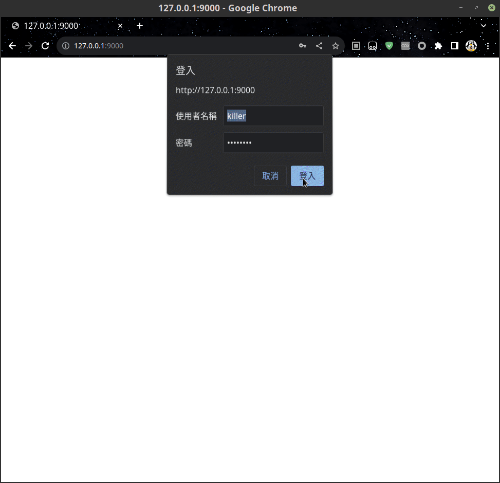

# xray-webui

xray-webui 是 xray 的一個跨平臺(桌面系統) webui，爲 linux windows mac 提供了一致的使用體驗。

默認設定下在運行主程式後需要使用瀏覽器訪問 [http://127.0.0.1:1989](http://127.0.0.1:1989) 來訪問 ui，它會要求你輸入默認的用戶名 killer , 以及默認的密碼 19890604


xray-webui 支持了 es6 [腳本](#腳本)，你可以通過修改腳本來支持最新的 xray 特性。或者將底層對 xray 的調用替換成爲任何其它的類似軟體。

Index:
* [安裝](#安裝)
* [更新](#更新)
* [設定](#設定)
* [腳本](#腳本)
* [userdata](#userdata)
* [透明代理](#透明代理)
    * [linux tproxy](#linux-tproxy)
    * [linux redirect](#linux-redirect)
    * [windows](#windows-tun2socks)
    * [mac](#mac)



# 安裝

1. [下載](https://github.com/zuiwuchang/xray-webui/releases)最新壓縮包並解壓
2. 下載最新的 [xray](https://github.com/XTLS/Xray-core/releases) 並解壓到 xray-webui 所在路徑的 xray 檔案夾下。

## linux 開機啓動

對於支持 systemd 的系統，你可以將 xray-webui.service 複製到 **/etc/systemd/system/** 檔案夾下並且啓用服務

```
# 創建服務
cp xray-webui.service /etc/systemd/system/

# 設置開機啓動
systemctl enable xray-webui.service

# 禁用開機啓動
# systemctl disable xray-webui.service

# 啓動服務
systemctl start xray-webui.service

# 關閉服務
# systemctl start xray-webui.service

# 查詢服務運行狀態
systemctl status xray-webui.service
```


> 此外如果你的程式不是安裝在 /opt/xray-webui 檔案夾中，要記得修改 xray-webui.service 中 ExecStart 屬性指定的啓動路徑

## windows 開機啓動

對於 windows 使用 WinSW 將其包裝成了服務，你可以使用管理員權限運行下述指令

```
@REM 安裝服務
xray-webui-service.exe install

@REM 卸載服務
xray-webui-service.exe uninstall
```

服務安裝成功的化會在系統重啓後自動運行，如果要立刻運行你可以在 windows 服務管理界面打開或關閉 xray-webui-service 服務


# 設定

設定檔是一個 [jsonnet](https://jsonnet.org/)，如果你不理解 jsonnet 你可以簡單的把它看作是一個比較容易書寫的 json。默認的設定檔都在主程序所在位置的 etc 檔案夾下

通常你只需要修改 ./etc/cnf/http.libsonnet 中的 Addr 來修改 webui 的監聽端口，以及 Accounts 來替換掉默認的管理用戶名密碼就好

# 更新

本程序只是一個界面 ui，它簡化了對 xray 的使用，通常不需要更新也很少有增加新特性。如果更新了特性你重新下載覆蓋掉主程序即可。

此外你應該關注 xray 的更新，當 xray 更新後下載最新的 xray 解壓到主程序所在位置的 xray 檔案夾即可。

此外當 xray 支持了新特性或協議時，腳本可能會更新，你可以下載最新腳本覆蓋掉主程序所在位置的 js 檔案夾即可


# 腳本

xray-webui 默認加載一個 js(js/main.js) 腳本，腳本必須導出一個 `export function create(): Provider` 函數

Provider 會橋接網頁 ui 以及對底層 xray 的調用，main.d.ts 中有詳細的定義，此外 ts 檔案夾下存放了一個官方維護的腳本，你可以參考它按需編寫自己的腳本

```
/**
    * 爲網頁 ui 提供了各種功能的具體實現
    */
export interface Provider {
    /**
    * 銷毀 Provider 和其綁定的資源
    */
    destroy?: () => void
    /**
    * 返回底層 xray 版本
    */
    version(): string
    /**
    * 返回透明代理設定
    */
    firewall(): string
    /**
    * 啓動透明代理
    */
    turnOn(opts: TurnOptions): void
    /**
    * 關閉透明代理
    */
    turnOff(opts: TurnOptions): void

    /**
    * 返回支持的節點元信息
    */
    metadata(): Array<Metadata>

    /**
    * 返回配置
    */
    configure(opts: ConfigureOptions): ConfigureResult

    /**
    * 返回啓動代理的命令
    * @param cnf 設定檔案路徑
    * @param opts 生成設定檔的原始參數
    */
    serve(cnf: string, opts: ConfigureOptions<Userdata>): ServeResult
}
```

* **destroy** 每次響應用戶 ui 請求時，都會調用腳本的 create 函數創建 Provider 實例，並在 實例不需要時調用 destroy(如果存在) 釋放資源
* **version** 返回 xray 版本號供網頁顯示，它只會被加載一次之後會被存儲在服務器緩存中
* **metadata** 返回了一個元信息，網頁 ui 會依據它爲各種協議生成輸入 ui，同時系統也會依據它的定義來解析與生成代理節點的訂閱信息
* **configure** 這個函數應該爲 xray 生成設定檔案的內容，以供後續使用它來啓動 xray
* **serve** 這個函數應該返回啓動 xray 的命令，cnf 是存儲了 configure 生成內容的檔案路徑

一些系統支持設置透明代理(目前官方只維護了 linux windows 腳本)，你可以修改下述三個函數來自定義如何啓動與關閉你所在平臺的透明代理

* **firewall** 它返回的內容會被顯示到網頁 `/settings/firewall` 頁面。用於顯示當前網頁設定(linux 目前只是打印了 iptables-save 設定)
* **turnOn** 它在用戶點擊網頁上的**啓用透明代理**等按鈕時被調用。(linux 目前是調用了 iptable 設置代理規則)
* **turnOff** 它在用戶點擊網頁上的**關閉透明代理**等按鈕時被調用。(linux 目前是調用了 iptable 設置刪除了 turnOn 時設置的規則)

# userdata

在網頁 /settings/general 頁面可以設置一個自定義的 userdata。它的格式是 [jsonnet](https://jsonnet.org/) 會被轉爲 json 傳遞給腳本。如果不了解 jsonnet 你可以把它簡單的理解成爲一個比較容易書寫的  json。

userdata 的內容完全由腳本決定如何使用。通常是一些代理相關的設定選項。

# 透明代理

透明代理可以讓系統上所有程序都通過代理訪問網路，但不同平臺支持方式和程度各異，如果無法正常工作你可能需要依據你的實際情況修改腳本。

如果平臺支持，你可以在網頁 ui 中點擊 開啓透明代理/關閉透明代理 等按鈕來 開啓/關閉 代理。這兩個按鈕實際上只是調用了腳本的 turnOn/turnOff 函數。

> 設置透明代理通常都需要系統管理員權限才能修改系統設定，所以如果要使用此功能請確保 xray-webui 運行在管理員權限下

## linux-tproxy

tproxy 擁有最完整的支持，它可以正確代理 udp/tcp。並且 xray 的路由可以正常工作，這意味這它可以正確分流朝鮮和非朝鮮的流量。

默認腳本需要將 userdata 中 proxy.tproxy 設置爲 true 才會啓用此功能。

> 切換了 tproxy/redirect 模式後，需要重啓 xray 進程在啓用透明代理。因爲不同模式需要生成不同的 xray 設定。

## linux-redirect

一些舊的系統或者 windwos 的 wsl 子系統中 tproxy 可能無法被完整的支持，此時只能使用 redirect 模式。要啓用 redirect 模式需要設置 proxy.tproxy 爲 true 之外的值

> 切換了 tproxy/redirect 模式後，需要重啓 xray 進程在啓用透明代理。因爲不同模式需要生成不同的 xray 設定。

redirect 只代理了 tcp 數據，並且因爲無法區分 xray 出棧流量所以除了到服務器和私有地址之外的所有地址都將使用代理訪問。這意味着任何策略和 xray 的路由都無法正常工作，所有流量都將經過代理而無法分流朝鮮和非朝鮮。

redirect 模式下只處理了 tcp 數據，所以遇到 dns 污染無能爲力，但你可以在 userdata 中設置一個 proxy.dns 值 (後續例子中假設它被設置爲 '127.0.0.1:10053')，這樣在啓動透明代理時腳本會自動創建下述規則將 dns 流量重新定位到一個無污染的 dns 服務器

```
iptables -t nat -D OUTPUT -p udp -m udp --dport 53 -j DNAT --to-destination 127.0.0.1:10053
iptables -t nat -D OUTPUT -p tcp -m tcp --dport 53 -j DNAT --to-destination 127.0.0.1:10053
```

此時我們還需要在 127.0.0.1:10053 上準備一個無污染的 dns，你可以使用 [coredns](https://github.com/coredns/coredns) 來輕鬆實現，只需要運行：

```
coredns -conf Corefile
```

Corefile 是設定檔案在本例子中可以按照如下填寫:

```
.:10053 {
	cache
	forward . 8.8.8.8 {
		force_tcp
	}
}
```

> 上述設定將在 任意地址上的 10053 端口上創建一個以 google 8.8.8.8 爲後端的 dns 服務，同時啓動了緩存並且和 8.8.8.8 間使用 tcp 通信。redirect 模式會自動將到 8.8.8.8 的 tcp 連接通過代理訪問所以不會被朝鮮投毒的 dns 污染。

# windows-tun2socks

windows 下需要使用 tun2socks 來支持透明代理，它將創建一個虛擬網卡並且通過修改路由規則來實現透明代理。它面臨的問題和 linux-redirect 類似，無法識別出 xray 的出棧流量，所以只能將到 xray 服務器的流量放行，其它的流量則都通過代理訪問。這導致策略和 xray 的路由都會失效，無法對朝鮮和非朝鮮流量進行分流

tun2socks 使用了 [https://github.com/xjasonlyu/tun2socks](https://github.com/xjasonlyu/tun2socks) 和 [https://www.wintun.net/](https://www.wintun.net/) 已經被打包到 tun2socks 檔案夾下，你或許可以從它們各自記得官網更新這兩個套件到最新版本

userdata 中的 proxy.tun2socks 定義了 tun2socks 相關設定

```
 {
	// socks5 代理地址 ip:port，默認爲 127.0.0.1:${userdata.proxy.port}
	// socks5: '192.168.1.1:1080',
	// 系統默認上網網關 ip
	gateway: '192.168.1.1',
	// 虛擬網卡使用的 dns 服務器 ip 地址，不能帶端口 
	dns: '8.8.8.8',
	// tun2socks 虛擬網卡 ip
	addr: '192.168.123.1',
	// tun2socks 虛擬網卡 子網掩碼
	mask: '255.255.255.0',
}
```

通常你只需要修改 gateway 爲你實際上網的網關地址，其它保持模式設定即可。當你點擊網頁上的啓動透明代理按鈕時，服務器會啓動一個 tun2socks 服務，並且修改 windows 的默認路由將到服務器以及 socks5 代理的地址路由到 gateway 填寫的網關地址 ，並將其它流量路由到虛擬的 tun2socks 網卡從而到達代理的目的。

當你點擊網頁上的關閉透明代理按鈕時，服務器會關閉 tun2socks 服務，同時修改 windows 的路由規則將之前設置到虛擬網卡的流量重新路由到 gateway 添加的網關地址

> tun2socks 支持 udp 流量所以與 linux-redirect 相比不會存在 dns 污染問題。
> 你可以不使用本機的 socks5 代理(userdata.proxy.port)，而是使用一個局域網內的 socks5 代理，此時可以將它填寫到 tun2socks.socks5 這樣局域網內的 socks5 因爲不受本機路由的影響，所以可以正確的處理 xray 的路由規則實現爲朝鮮和非朝鮮流量分流

# mac

因爲我沒有 mac 的設備所以沒有使用過這個系統，也無法進行調試。目前你需要自己修改腳本來支持它。但 mac 好像使用了類似 linux 的 iptables 架構，你或許可以參考下 linux 的腳本實現。

此外如果你改好了腳本，很歡迎你 pull 一個 commit 我會將它合併到項目以方便其它 mac 用戶可以方便使用